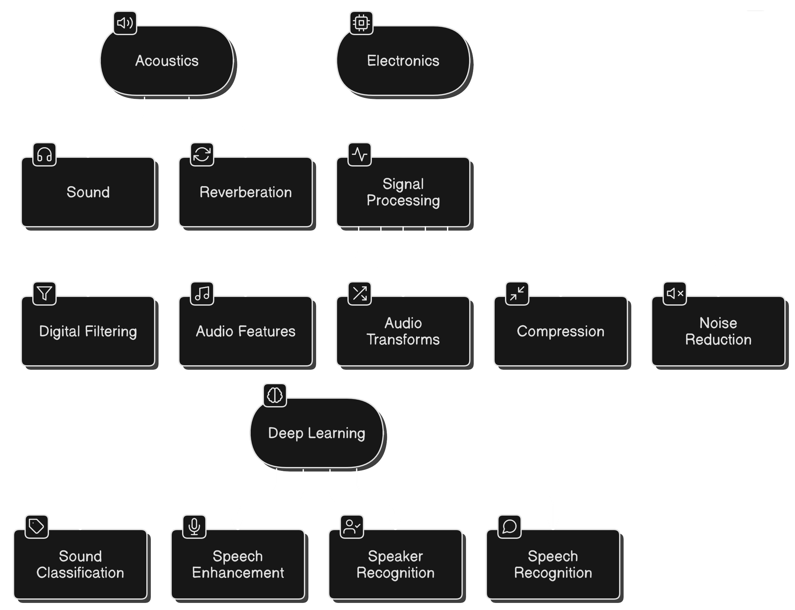

# Speech & Audio Interview Questions
Feel free to dive into any section that interests you :-)

Table of contents

- [Speech \& Audio Algorithms and Machine Learning](#speech--audio-algorithms-and-machine-learning)
- [Table of contents](#table-of-contents)
- [Acoustics ](#acoustics-)
  - [Sound ](#sound-)
  - [Reverberation ](#reverberation-)
- [Electronics ](#electronics-)
- [Signal Processing ](#signal-processing-)
  - [Digital Filtering ](#digital-filtering-)
  - [Audio Features ](#audio-features-)
  - [Audio Transforms ](#audio-transforms-)
  - [Compression ](#compression-)
  - [Noise Reduction ](#noise-reduction-)
- [Deep Learning ](#deep-learning-)
  - [Sound Classification ](#sound-classification-)
  - [Speech Enhancement ](#speech-enhancement-)
  - [Speaker Recognition ](#speaker-recognition-)
  - [Speech Recognition ](#speech-recognition-)

# Acoustics 

## Sound 

* What is the difference between sound power and sound intensity?
* How do we convert sound pressure between dB SPL and pascals (Pa)?
* What’s the difference between dB SPL and dB(A)?
* How do density and elasticity of a medium affect sound speed?
* What is the Doppler effect, and how does it work?

## Reverberation 

* What is room impulse response (RIR), and how is it measured?
* What are the effects of reverberation in room acoustics?
* How is reverberation measured (RT60)?
* How can we simulate reverberation digitally?
* What methods are used to analyze time delay in audio signals?

# Electronics 

* What should you consider when choosing a microphone?
* How do you calibrate a microphone?
* What is an Anti-Aliasing filter?
* What are typical sampling rates and bit ranges for audio?
* What are the common interfaces used in digital audio systems?

# Signal Processing 

## Digital Filtering 

* How do FIR and IIR filters differ?
* What does the filtfilt function do?
* How does a preamplifier work in a microphone setup?
* How is zero-phase filtering done, and what are its benefits?
* How can we test the stability of digital filters?

## Audio Features 

* What is signal energy, and how do we calculate it?
* What are the uses of ZCR and FFT in audio analysis?
* How can we estimate the pitch of speech?
* What are common audio features, and how do we extract them?
* How can we test the similarity between two audio signals?

## Audio Transforms 

* What is STFT, and how is it done?
* What are the key considerations when implementing STFT?
* What is MFCC used for in audio processing?

## Compression 

* How does the number of quantizer levels change the dynamic range?
* How does AD-PCM work?
* What is LPC, and how does it represent speech?
* How is mu-law quantization different from linear quantization?

## Noise Reduction 

* How does spectral subtraction work?
* What is the Wiener filtering method?
* When is wavelet-based denoising useful?
* What is Speech Presence Probability (SPP), and how is it used?
* How is adaptive filtering used for noise reduction and echo cancellation?

# Deep Learning 

## Sound Classification 

* What are the challenges in sound classification?
* How is deep learning used in sound classification?
* What metrics evaluate classification models?

## Speech Enhancement 

* What deep networks are common for speech enhancement?
* How is phase handled in speech enhancement?
* Why might MSE not be the best loss function?
* What metrics evaluate speech enhancement models?

## Speaker Recognition 

* What’s the difference between diarization, identification, and verification?
* What networks are used for speaker recognition?
* What are speaker embeddings, and how are they used?
* How are x-vectors different from i-vectors?

## Speech Recognition 

* What methods are used for speech recognition?
* How is audio prepared for speech recognition?
* How are speech recognition models evaluated?
* How does Whisper use weak supervision?
* What is the Whisper model architecture?
* What are the key features and differences between Wav2Vec models?
* How does CTC encoding help Wav2Vec?
* What’s the role of Beam Search in Wav2Vec?
